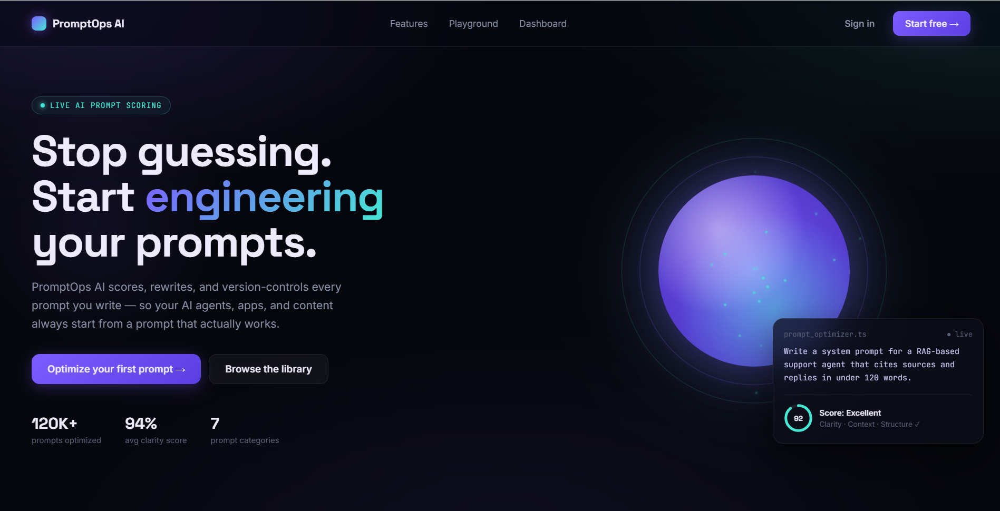
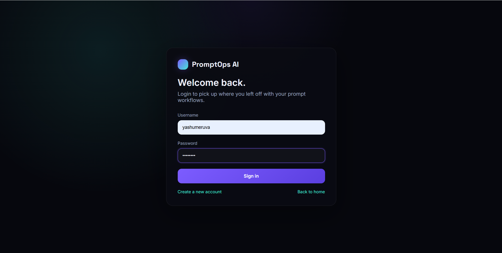
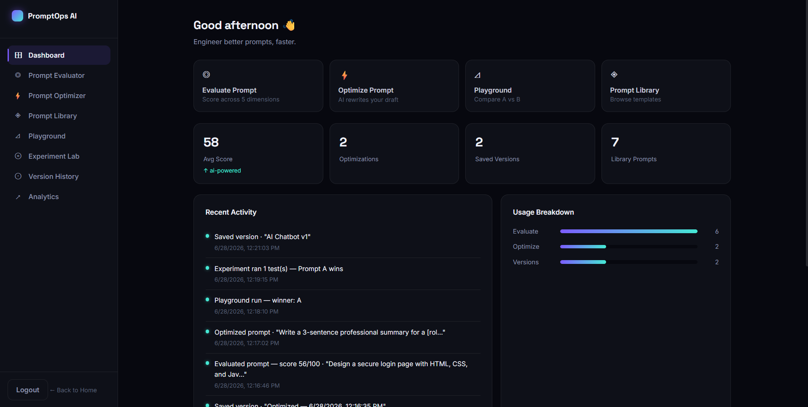
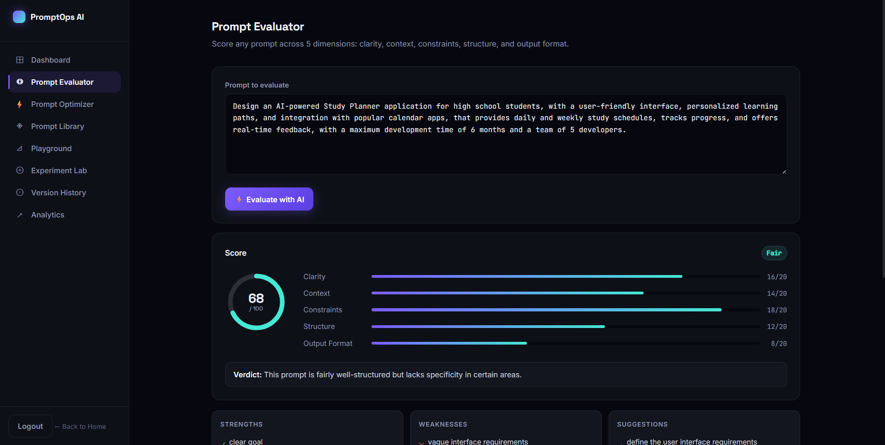
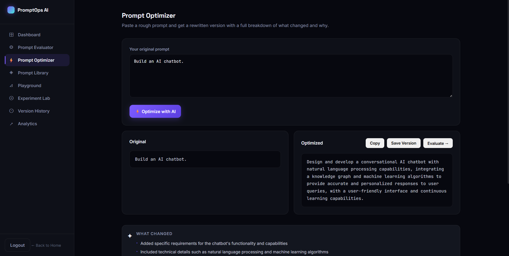
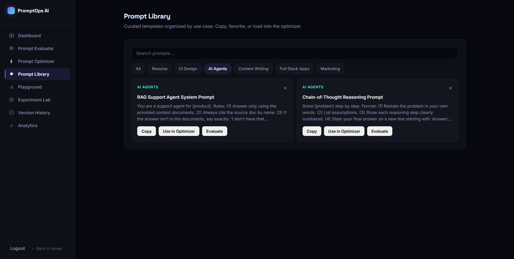
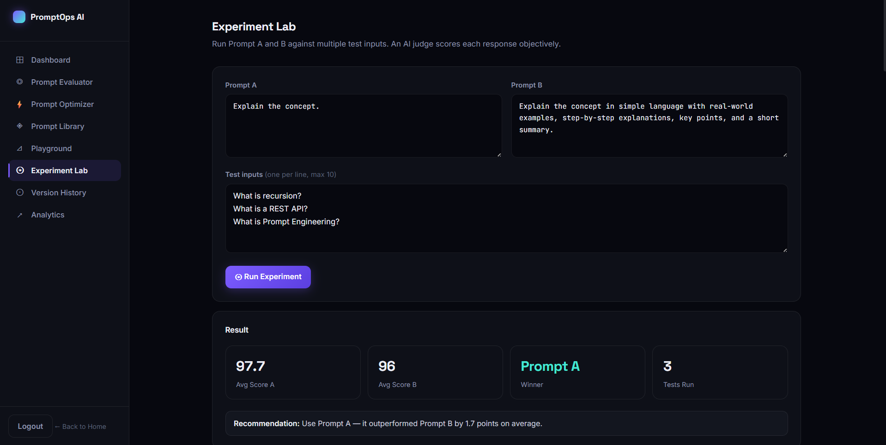
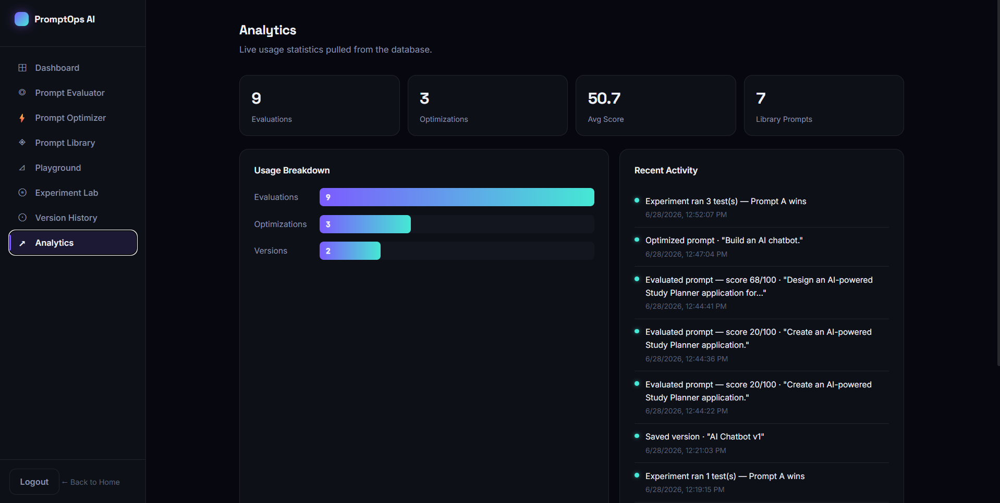

# 🚀 PromptOps AI

> **An AI-powered Prompt Engineering Workspace for evaluating, optimizing, testing, versioning, and managing prompts using Groq LLaMA.**

PromptOps AI is a full-stack platform built for developers, AI engineers, and prompt engineers to create better prompts faster. It combines AI-powered prompt evaluation, optimization, experimentation, version control, analytics, and prompt management into one modern workspace.

---

# 📖 Overview

Writing high-quality prompts has become an essential skill when working with Large Language Models (LLMs). PromptOps AI simplifies this process by providing an intelligent workspace where users can:

* Evaluate prompt quality
* Optimize prompts using AI
* Compare prompt versions
* Save reusable prompt templates
* Perform A/B prompt testing
* Track prompt engineering activity
* Manage prompt history

The project demonstrates practical applications of Prompt Engineering, AI-assisted workflows, authentication systems, REST APIs, and modern full-stack development.

---

# ✨ Features

## 🔍 Prompt Evaluator

* Evaluate prompts across multiple quality dimensions
* AI-generated feedback and suggestions
* Prompt scoring system
* Readability and effectiveness analysis

## ⚡ Prompt Optimizer

* AI-powered prompt rewriting
* Improve clarity and specificity
* Enhance instruction quality
* Compare original vs optimized prompts

## 📚 Prompt Library

* Store reusable prompt templates
* Browse categorized prompts
* Copy and reuse templates instantly

## 🎮 Playground

* Test prompts in real time
* Experiment with different prompt styles
* Compare multiple outputs

## 🧪 Experiment Lab

* A/B prompt testing
* Side-by-side comparison
* Prompt experimentation workflow

## 📝 Version History

* Save prompt versions
* Restore previous versions
* Copy or delete saved prompts
* Maintain prompt evolution history

## 📊 Analytics Dashboard

* Track prompt evaluations
* Monitor optimization usage
* View workspace statistics
* Activity tracking

## 🔐 Authentication

* Secure user registration
* JWT authentication
* Password hashing with bcrypt
* Protected API routes

---

# 🛠️ Tech Stack

## Frontend

* HTML5
* CSS3
* JavaScript (ES6)

## Backend

* FastAPI
* SQLAlchemy
* PostgreSQL (Neon)
* JWT Authentication
* Passlib (bcrypt)

## AI

* Groq API
* LLaMA 3.3 70B

## Deployment

* Render (Backend)
* Render Static Site (Frontend)

---

# 📂 Project Structure

```text
PromptOps-AI/
│
├── app/
│   ├── routers/
│   ├── services/
│   ├── database.py
│   ├── auth.py
│   ├── dependencies.py
│   ├── schemas.py
│   └── main.py
│
├── frontend/
│   ├── css/
│   ├── js/
│   ├── app.html
│   ├── login.html
│   ├── signup.html
│   └── index.html
│
├── tests/
├── requirements.txt
└── README.md
```

---

# 🚀 Live Demo

### Live Application

https://promptops-ai-1.onrender.com


## 📸 Screenshots

### Landing Page



### Authentication



### Dashboard



### Prompt Evaluator



### Prompt Optimizer



### Prompt Library



### Experiment Lab



### Analytics Dashboard



# 🎯 Future Enhancements

* Multi-LLM Support (OpenAI, Gemini, Claude, Mistral)
* Prompt Marketplace
* Team Collaboration Workspace
* Prompt Sharing
* AI-generated Prompt Recommendations
* Export Prompts (PDF, Markdown, JSON)
* Advanced Prompt Analytics
* Real-Time Collaboration
* Dark & Light Theme Toggle
* Browser Extension

---

# 💡 Why I Built This Project

As AI tools become increasingly integrated into software development, prompt engineering has become a valuable technical skill. I built PromptOps AI to create a dedicated workspace where developers can evaluate, optimize, organize, and experiment with prompts efficiently.

This project combines modern AI workflows, authentication, REST APIs, database management, and full-stack development into a practical application that reflects real-world software engineering practices.

---

# 👨‍💻 Author

**M. Reddy Yasaswini**

B.Tech Computer Science Engineering (2028)

AI & Software Engineering Enthusiast

LinkedIn: https://www.linkedin.com/in/reddy-yasaswini

GitHub: https://github.com/yasaswini-meruva

---

# ⭐ Support

If you found this project helpful, consider giving it a ⭐ on GitHub.
